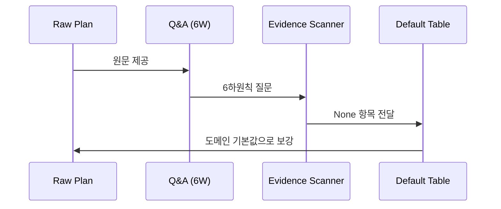

## Enriched Plan

ADHD 플래너 제품의 SNS 브랜딩을 자동화하는 **반자동(승인제) 콘텐츠 에이전트**다. 원문 의도는 "리소스 없이도 진정성을 지키면서 꾸준히 발행"이며, 이를 위해 생성은 완전 자동화하되 **게시 직전 사람의 1탭 승인**을 안전장치로 둔다.

### 핵심 가치 (원문 보존, 명료화)
- **변환 대상:** ADHD 플래너의 메시지 "흐릿한 목표 → 지금 할 첫 행동"을 인스타그램 카드뉴스 + 스레드 텍스트로 변환.
- **운영 모델:** 자동화 90% / 사람 개입 10%. 기획·카피·이미지는 에이전트가, 게시 결정은 사람이 텔레그램에서 "게시/수정/폐기" 1탭.
- **핵심 제약:** 진정성. 완전 무인 봇 인상은 ADHD 커뮤니티 신뢰를 깎으므로 승인 단계를 항상 유지한다.

### 콘텐츠 시스템
- **기둥 4종:** 공감형(저장·공유 유발), 실전팁형(유용성), 비포애프터형(제품가치 노출), 빌드인퍼블릭형(얼리어답터 모집).
- **인스타 cadence:** 주 3회 — 월=공감 / 수=실전팁 / 금=비포애프터·빌드인퍼블릭 격주 교차. 카드 5~7장(1장 후킹 → 2~6장 한 장 한 메시지 → 마지막 CTA).
- **스레드 cadence:** 매일 1회 — 월·목 진지 / 화·금 일상+가벼운 홍보 / 수 질문형 / 토·일 짧은 공감. 글당 280자 내외.

### 생성 규칙 & 가드레일 (생성 프롬프트 + 승인 체크리스트 양쪽에 심음)
- 추상어("열심히") 금지 → 항상 구체 장면·결과 기준. 자책 유발 금지 → 복귀·재시작 함께 제시.
- 미확인 통계 금지(환각 방지), 남의 사연·캡처 금지(여러 사례를 익명 일반 상황으로 재구성), 의학적 단정 금지 + "의학적 조언 아님" 면책, 출처 표기.
- **게시 전 자동 체크리스트 4종:** ① 미확인 통계 ② 남의 사연·캡처 ③ 의학 단정 ④ 출처 필요 이미지.

### 구동 구조 (Cron + Webhook)
- **Cron(생성을 깨움):** 매주 일요일 밤 = 다음 주 캘린더 + 카피 일괄 / 매일 오전 8시 = 그날 스레드 / 월·수·금 = 인스타 카드뉴스.
- **Webhook(반응):** 텔레그램 "게시" 클릭 → 실제 게시 / 댓글 발생 → 답변 초안 생성 → 알림.
- 생성은 완전 자동, 게시는 사람의 1탭이 트리거(생성과 게시 사이의 "멈춤"이 5분 승인제 구현 지점).

### 기술 스택 (원문 명시)
Claude API(카피) · pencil.dev(이미지 슬롯) · 텔레그램 봇(승인) · n8n(오케스트레이션) · IG Graph API + Threads API(게시·수집).

### Open Assumptions
원문에 증거가 `None`인 항목을 도메인 합리적 기본값으로 채운 **가정**이다(신규 기능 발명 아님).

1. **콘텐츠/실행 언어:** 한국어 콘텐츠. ADHD 한국 커뮤니티 타깃으로 가정.
2. **타임존:** Cron 시각(오전 8시 등)은 `Asia/Seoul` 기준으로 가정.
3. **승인 대기 만료:** 승인 알림 후 일정 시간(기본 24h) 내 무응답이면 자동 폐기(자동 게시 아님 — 진정성 제약 준수). 정확한 만료값은 운영 설정.
4. **pencil.dev 연결 방식:** 미확정 → 코드는 **범용 슬롯 JSON 계약**(`{slotId, role, text, maxChars}`)과 어댑터 인터페이스만 정의하고 실제 연결은 외부 설정 시점으로 미룸.
5. **Claude 모델:** 카피 생성에 최신 Claude 모델 사용(기본 `claude-opus-4-8` / 비용 민감 시 `claude-sonnet-4-6`), `ANTHROPIC_API_KEY` 환경변수. 키 부재 시 결정적 오프라인 stub로 동작(개발·테스트 가능).
6. **호스팅:** 1차 n8n 클라우드 Starter, 추후 자체 호스팅 이전(원문 전략 계승).
7. **계정/심사:** IG 비즈니스 계정 + 페이지 연결, 앱 심사 2~4주는 외부 절차 → 코드는 자격증명을 env로 주입받는 어댑터까지만.
8. **댓글 응대:** 초안까지만 자동, 게시는 승인(원문 Out of scope 준수).
9. **저장소/상태:** MVP는 파일/경량 스토어(JSON) 기준 캘린더·콘텐츠 상태 관리로 가정(n8n 외부 DB 없이 시작).

### Evidence Table
| 질문 (6W) | 증거강도 | 출처 / 기본값 |
|---|---|---|
| What — 무엇을 만드나 | High | 원문: 반자동 SNS 콘텐츠 에이전트 |
| Why — 왜 | High | 원문 §문제: 리소스 부재·지속성 실패·진정성 리스크 |
| Who — 사용자 | Med | 원문: 운영자(승인자) 1인 + ADHD 커뮤니티(수신자). 단일 운영자로 가정 |
| How — 어떻게 동작 | High | 원문 §구동: Cron 생성 + Webhook 게시, 텔레그램 승인 |
| When — 언제 | High | 원문 cadence(주3 IG / 일1 스레드) + Cron 시각 |
| Where — 어디서 실행 | Med | 원문: n8n 클라우드 Starter(택일). 1차 Starter로 가정 |
| 언어/로케일 | None | 기본값: 한국어 / Asia/Seoul |
| pencil.dev 연결 API | None | 기본값: 범용 슬롯 JSON 계약 + 어댑터 인터페이스 |
| Claude 모델/키 | Low | 원문 "Claude API". 기본값: opus-4-8, env 키, 무키 stub |
| 승인 만료 정책 | None | 기본값: 24h 무응답 → 자동 폐기(자동 게시 금지) |
| 상태 저장소 | None | 기본값: 경량 JSON 스토어 |

### 추론 시퀀스 다이어그램

